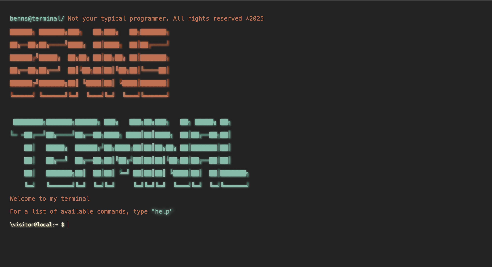

<h1>Terminal</h1>

Welcome to my interactive terminal!

Here you can play for a bit. If you type "Help" you can check the available commands on the terminal

<pre>"help              You already know what this does...",
  "whois             Get to know me a little bit better",
  "socials           Don't forget to follow me",
  "github            Visit my github page, don't forget to follow!",
  "email             Do not, and I repeat, do not email me(unless you have work for me)",
  "banner            Self-explanatory, it shows the header",
  "myprojects        Take a look at my projects",
  "clear             Clear the terminal"</pre>

