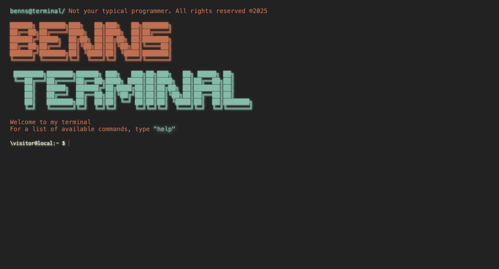

<h1>💻 Welcome to my interactive terminal</h1>

<h2>Description</h2>

This is just a little project of mine inspired by <a href="https://github.com/ForrestKnight">Forrest Knight.<a>

I hope you enjoy!

<h3>[!screenshot!]</h3>

